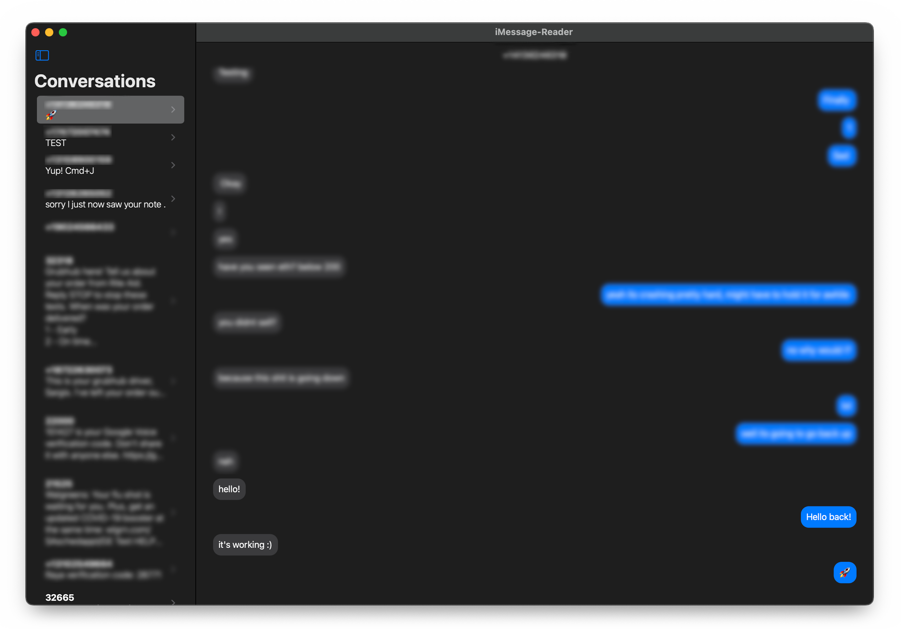

## iMessage Reader

This application is a Mac Catalyst app that is able to read files on MacOS outside of the sandbox. It accomplishes this by embedding a MacOS bundle inside of it. Within the bundle `AppKit` is available and thus `NSOpenPanel` is too.

A fun demonstration of this was to have it parse the Sqlite database file on MacOS that stores all your SMS and iMessages.

The project uses a protocol added to both the catalyst app and the bundle target to define a common interface of communication. The catalyst app opens the embedded bundle, dynamically creates an instance of a class conforming to this custom protocol in the bundle, and then itself casts the class to the protocol itself so that the catalyst app can then interact with the code defined in the bundle, thus giving it full access to `AppKit`.

I think this technique is neat because this lets you take a fully written iOS app and re-use virtually all of it as a Mac App. This is something Catalyst gives you for free, but now you're additionally able to access AppKit and other MacOS APIs without restrictions, which enables you to make your iOS app feel fully at home on MacOS. Hopefully enabling you to provide a native-feeling experience for your users.

Another interesting thing about this project is that it uses permanent bookmarks to persist access to the file outside of the sandbox, meaning when you quit and restart the application, it continues to have access to the non-sandbox app containing iMessages.
